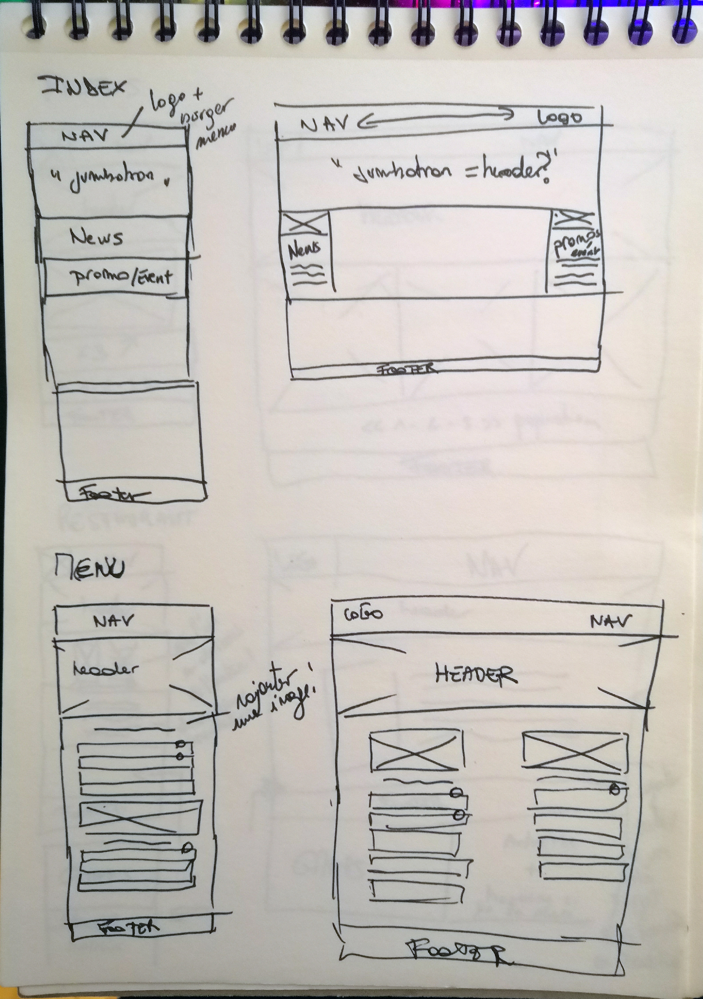
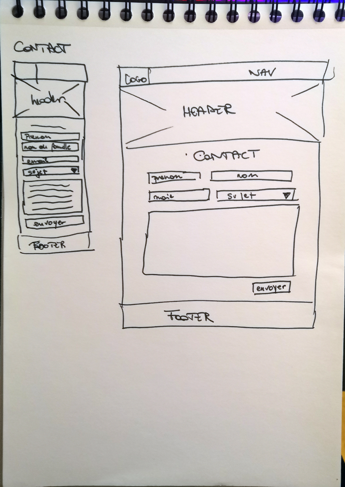

# 01 - The Field : Restaurant-css-framework project "Au Joyeux Bordel de Nath"
## Lien du projet (WIP)
https://nathalie-anneessens.github.io/restaurant-css-framework/structure.html
## Mais keskesé ? 
Pour "consolider" nos connaissances du framework css Bootstrap, nous  avons pour challenge de réaliser un site web pour un restaurant fictif qui se doit d'etre mobile first (le site web, pas le restaurant...)  
[Lien vers les consignes](https://github.com/becodeorg/BXL-Swartz-4-27/blob/master/1.The-Field/6.Bootstrap/restaurant.adoc)

**Au Joyeux Bordel de Nath** est donc mon projet de restaurant. Il fait partie d'une franchise de gens qui cuisinent eux aussi dans le bazar (*Au joyeux bordel de...*) et préparent des recettes pour les partager avec leurs voisins (les gentils, pas ceux qui hurlent et/ou déménagent leurs meubles à longueur de journée en forant le dimanche à 8h du matin...)

## Et t'as pondu ça quand !? 
Le projet a commencé le 28 janvier au matin et finira théoriquement le 2 février à 17h. En pratique, nous avons 4 journées complètes de formation pour le faire ! 

## Et où ? 
Eh beh... Dans mon joyeux bordel, sur ma chaise de bureau Ikea (et mon bureau Ikea) et sur mon pc fixe. En compagnie d'une theière d'infusion Mojito Framboise, chauffée par des bougies Ikea (non je n'ai pas d'actions chez eux) et de ma fameuse playlist *"Playlist dont j'ai aucune idée de sur quoi elle se base mais elle est sympa"* :metal:

## Et comment ?
Avec :
- HTML 5
- CSS 3
- Bootstrap 5.0 beta <del>(des enfers)</del>

## Progession 
... Euh... :thinking:  

- [x] Faire un pseudo planning sur Notions
- [x] Ecrire ce fichier readme brut de décoffrage
- [x] Chercher des designs de site web réalisables "facilement" avec Bootstrap (Beuheuheuh :cry: )
- [x] Créer les fichiers html, css de base et les dossiers
- [x] Faire des wireframes et layouts papier
- [x] Créer un fichier html de structure pour le contenu et les choses qui vont être copiées collées sur chaque page et ne rien comprendre aux 758 class de bootstrap :sleepy: :rage:
- [ ] Vérifier que le design global est cohérent
- [ ] Copier coller les éléments de la structure dans les bonnes pages
- [ ] Vérifier que tous les liens sont fonctionnels
- [ ] Faire un peu de CSS pour rendre le design moins eco+ (*phase de polish, si on a le temps*)
- [ ] Me servir la bière offerte par Hello Fresh cette semaine pour célébrer le fait d'avoir fini le projet 
## Processus "créatif"
### Wireframes

 